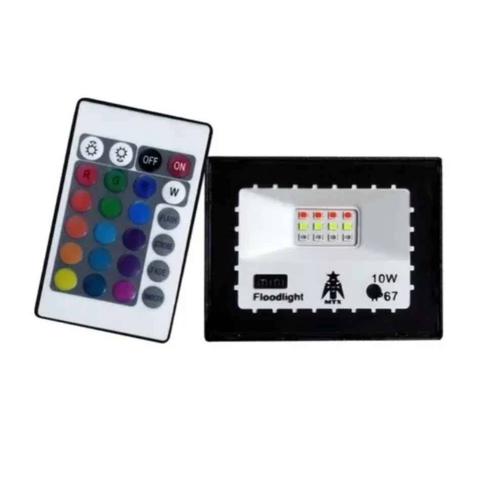
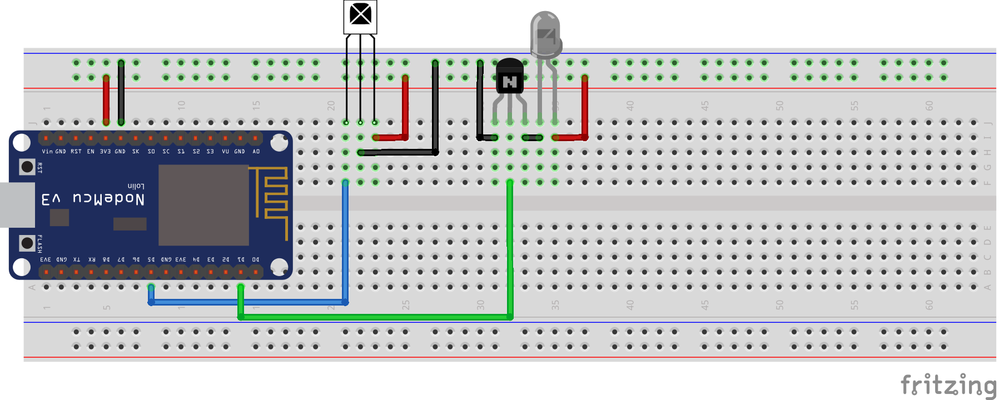

# Controle Remoto IOT

Esse projeto foi feito com a idéia de colocar aqueles refletores de LED RGB na automação Residencial aqui de casa (Home Assistant).
Para isso fiz em live a implementação do Controle Remoto que agora se conecta ao meu servidor de MQTT, e eu posso mandar os comandos do conetrole NEC diretamente para ele, e isso será replicado no destino que eu quiser, explico melhor abaixo.

## O Refletor

Comprei esse refletor na Shopee (Dalhe frete gratis! :D \o/ - para nossa alegria), ele vem com o controle de Infra Vermelho, onde podemos fazer a configuração apertando os botões.
No caso, o meu refletor é de 30w e eu uso para iluminar a parede aqui de casa nas lives que faço na twitch, aproveitando, clica aqui -> [kaduzius] <- e já da aquele follow pra ajudar :P

## O problema
Sempre que vou iniciar a live, preciso preparar todo o ambiente aqui, ligar a fita de Led de efeitos, a matrix de led e o refletor, e como somos todos preguiçosos já deixei automatizado tanto a fita de led [WLED] e a [LedMatrix], então estava faltando poder fazer a mesma coisa com o Refletor.

## A solução
Como uso o Home Assistant aqui em casa e muita coisa pendurada no servidor de MQTT dele, então a maneira mais fácil de fazer isso seria disponibilizar um "controle remoto" no meu IOT, e para fazer isso, usei o já conhecido (ao menos por mim) firmware para o microcontrolador ESP8266 (nodemcu no caso) chamado [HomieIOT].
Esse firmware resolve *UM MONTÃO* de coisas, fica a recomendação pra você dar uma olhada nele, toda a parte de configuração de rede wifi automatica (por aplicativo), configuração do server de MQTT, comunicação com o server, aquela estrutura de mensagens sobre a "vida" do dispositivo, que fala sobre versão do software, qualidade do wifi, tmepo que o MCU está ligado, e outras cosias importantes quando tempos esses dispositivos pendurados em nossa rede, já vem pronto, bastando apenas programar o que de fato queremos automatizar, como você pode ver, o programa fica bem enxuto. Em tempo, esse cara também já deixar pronto a parte de "OTA" (Update Over the Air). Se você já fez isso na mão alguma vez, sabe o quão quebrador de galho, ter tudo isso pronto é!
Nesse firmware você só fala O que é o seu Nó (sensor) quais tipos de dados ele envia, e se ele pode ser ou não  alterado remotamente (tipo ligar / desligar luz).

## O circuito

## A idéia e o código

Já havia usado a biblioteca [IRremoteESP8266], em uns testes que fiz para ligar e desligar Televisões, ai então já tinha uma idéia do que fazer, só precisava descorbrir qual era o protocolo de Infra Vermelho usado pelo controle, que finalmente descobri ser NEC, E com isso peguei a lista dos botões que é possivel você ver ali no diretório SRC.
Então só faltava por isso na automação, como disse usei o firmware HomieIOT e a idéia foi que eu mando o código Hexa decimal do controle via mensagem MQTT para um tópico específico e ele replica isso no controle, dessa forma nosso dispositivo ficou generico para controles que usem o protocolo NEC.
Um detalhe legal, porém que não está implementado, apesar do circuito estar feito, é que é possivel usar nosso circuito como receptor de IR, assim da pra descobrir qual é o protocolo de um outro controle que está por perto (talvez essa seja uma possível funcionalidade futura), fazendo com que nosso Controle Remoto IOT vire aqueles carinhas que compramos por $50 no Aliexpress e é um "Controle Remoto Universal Conectado".

## E Eu com isso?
É eu também não sei o que você tem haver com isso, mas já agradeço por ter lido a documentação até aqui, Obrigado, Aquele abraço e é isso ae!

BrigaDUUUUU (tipo Fabio jr).

[kaduzius]: <http://twitch.tv/kaduzius>
[LedMatrix]: <https://github.com/kadu/LedMatrixHomieIOT>
[WLED]: <https://github.com/Aircoookie/WLED>
[HomieIOT]: <https://homieiot.github.io/>
[IRremoteESP8266]: <https://github.com/crankyoldgit/IRremoteESP8266>
